# 🚏 Índice
[🚀 Sobre este projeto](#-sobre-este-projeto)
  - [Backend](#backend-api)
  - [Frontend](#frontend-extensão-do-chrome)

[🧰 Tecnologias e ferramentas](#-tecnologias-e-ferramentas)
  - [Backend e Frontend](#para-este-projeto-foram-utilizados)
  - [Backend](#backend-api-1)
  - [Frontend](#frontend-extensão-do-chrome-1)

[📋 Instruções](#-instruções)
  - [Inicialização](#-inicialização)
  - [Backend](#backend-api-2)
  - [Frontend](#frontend-extensão-do-chrome-2)

[⚙️ Rodando o projeto](#-rodando-o-projeto)
  - [Backend](#backend-api-3)
  - [Frontend](#frontend-extensão-do-chrome-3)

[🧪 Testando o projeto](#-testando-o-projeto)
  - [1️⃣ Testes unitários](#-testes-unitários)
    - [Backend](#backend-api-4)
    - [Frontend](#frontend-extensão-do-chrome-4)
# 🚀 Sobre este projeto

Este projeto é composto por uma API REST e uma extensão do Chrome (Manifest v3), que se comunica com a API.

### Backend (API)

A API tem os seguintes endpoints:

> ### POST /auth/login
>
>> Realiza o login do usuário

---

> ### POST /auth/register
>
>> Cadastra um novo usuário

---

> ### POST /items
>
>> Cria um novo item no banco de dados

---

> ### GET /items
>
>> Retorna todos os itens de um usuário

---

> ### PATCH /items/:id/complete
>
>> Altera o status do campo `completed` de um item de `false` para `true`

---

> ### DELETE /items/:id
>
>> Altera o status do campo `deleted_at` de um item de `null` para a data e hora atual. É realizada apenas a deleção lógica


### Frontend (extensão do Chrome)

A extensão permite:

 - inserir tarefas

 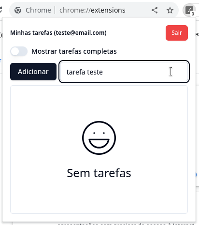

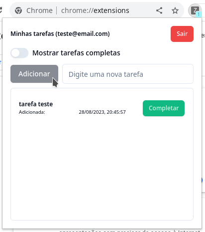

 - marcar tarefas como completas

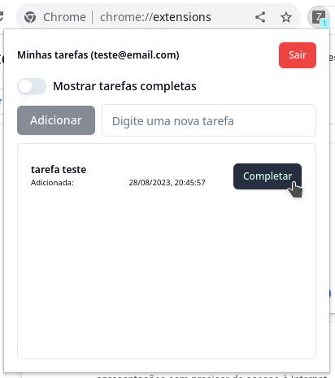


 - mostrar ou ocultar tarefas completas

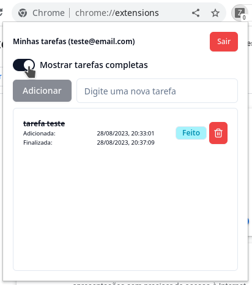

 - remover tarefas

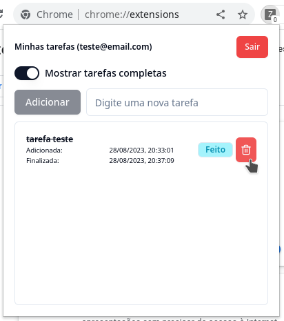

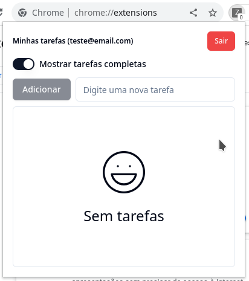

 - realizar logout e login como outro usuário

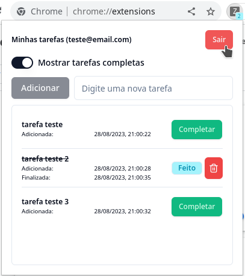

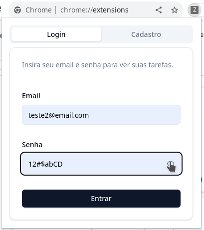


A extensão mostra o número de tarefas não completas como um contador no ícone da extensão (somente quando o usuário está logado):

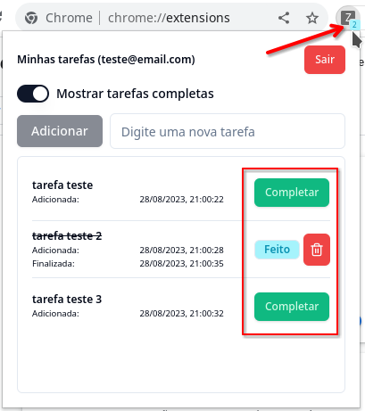

Tem autenticação básica com email e senha:

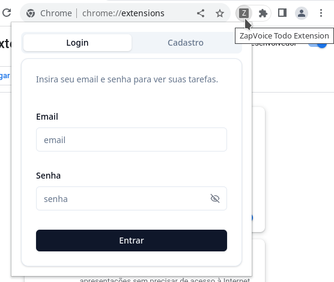

E se necessário é possível cadastrar novo usuário:

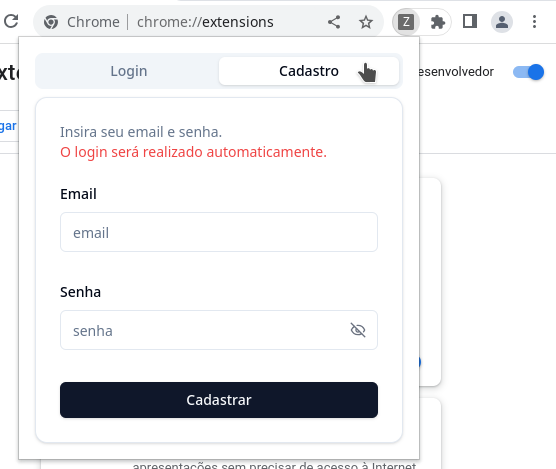

## 🧰 Tecnologias e ferramentas

### Para este projeto foram utilizados:

- [Typescript](https://www.typescriptlang.org/)

- [Docker](https://www.docker.com/)
  - [Docker Compose](https://docs.docker.com/compose/)

- [Prettier](https://prettier.io/) para formatar o código de forma consistente

- [EsLint](https://eslint.org/) para verificar possíveis problemas no código

### Backend (API)

- [NestJS](https://nestjs.com/) Um framework progressivo para o Node.js. Escolhi este framework por facilitar o desenvolvimento de uma api eficiente, segura e escalável

- [Passport](https://www.passportjs.org/), middleware para auxiliar na autenticação

- Validação:
  - Seguindo a [documentação do Nest](https://docs.nestjs.com/techniques/validation), para validar os dados que chegam à API foram utilizados:
    - [class-validator](https://github.com/typestack/class-validator)
    - [class-transformer](https://github.com/typestack/class-transformer)

- Banco de dados:
  - [MySQL](https://www.mysql.com/)
    - [via Docker](https://www.docker.com/)
  - [Prisma](https://www.prisma.io/) como ORM

- Testes:
  - [Jest](https://jestjs.io/), ferramenta padrão de testes do NestJS

### Frontend (extensão do Chrome)

- [React](https://react.dev/)

- [Vite](https://vitejs.dev/)

- [CRXJS Vite Plugin](https://crxjs.dev/vite-plugin/), um plugin para o bundler Vite, que facilita MUITO o trabalho de criar extensões para o Chrome com React (entre outros frameworks)

- [React Hook Form](https://react-hook-form.com/), escolhi esta biblioteca por permitir criar forms performáticos, flexíveis e extensíveis, além da facilidade de validação com o zod

- [zod](https://zod.dev/) para validação dos forms

- Estilização:
  - [TailwindCSS](https://tailwindcss.com/), framework CSS, _utility first_. Escolhi o Tailwind pela facilidade de uso e customização, além de ser a base para os componentes utilizados (shadcn/ui)
  - [shadcn/ui](https://ui.shadcn.com/), uma coleção de componentes reutilizáveis criados com Radix UI TailwindCSS. Escolhi utilizar esses componentes porque são baseados no Radix UI, e por isso já tem acessibilidade implementada, além de serem fáceis de customizar
  - [Lucide React](https://lucide.dev/guide/packages/lucide-react), biblioteca de ícones em SVG

- Testes:
  - [Vitest](https://vitest.dev/) para os testes unitários
  - [MSW](https://mswjs.io/) para mockar a API nos testes

# 📋 Instruções

Clone o projeto:

```bash
git clone git@github.com:israelss/zapvoice-todoextension.git
```

## 🏁 Inicialização

Após clonar o projeto, suba os _containers_ com o docker compose:

```bash
docker compose up -d
```

### Backend (API)

Em outro terminal, entre no _container_ da api e instale as dependências:

```bash
docker compose exec api bash
# já dentro do container
npm install
```

Crie o arquivo `.env` na pasta `api`, e preencha com as variáveis necessárias (abaixo um exemplo):

```sh
DATABASE_URL="mysql://dbuser:123456@db:3306/dbname"
JWT_SECRET="jwtsecret"
```

Crie o banco de dados:

```bash
npx prisma migrate dev
```

_⚠️ Caso necessite recriar o banco execute o comando ⚠️:_

```bash
npx prisma migrate reset
```

### Frontend (extensão do Chrome)

Em outro terminal, entre no _container_ da extensão e instale as dependências:

```bash
docker compose exec extension bash
# já dentro do container
npm install
```

Crie o arquivo `.env` na pasta `extension` e preencha com as variáveis necessárias (abaixo um exemplo):

```sh
IMAGE_INLINE_SIZE_LIMIT=0
INLINE_RUNTIME_CHUNK=false
VITE_API_BASE_URL="http://localhost:3000"
VITE_EMAIL_KEY="email"
VITE_ERROR_KEY="errorMessage"
VITE_TOKEN_KEY="access_token"
```

## ⚙️ Rodando o projeto

### Backend (API)

No terminal com o _container_ da api inicie o servidor de desenvolvimento:

```bash
npm run start:dev
```

### Frontend (extensão do Chrome)

#### Modo de desenvolvimento

No terminal com o _container_ da extensão inicie o servidor de desenvolvimento:

```bash
npm run dev
```

Abra o chrome e carregue a extensão sem compactação de acordo com as instruções abaixo (instruções atualizadas e completas [disponíveis aqui](https://developer.chrome.com/docs/extensions/mv3/getstarted/development-basics/#load-unpacked)):

1. Vá para a página de extensões inserindo `chrome://extensions` em uma nova aba.
2. Habilite o Modo do desenvolvedor clicando no _toggle switch_ ao lado do texto **Modo do desenvolvedor**.
3. Clique no botão **Carregar sem compactação** e selecione o diretório da extensão (`[caminho_onde_o_projeto_foi_clonado]/extension/dist`)

Fixe a extensão de acordo com as instruções abaixo (instruções atualizadas e completas [disponíveis aqui](https://developer.chrome.com/docs/extensions/mv3/getstarted/development-basics/#pin)):

1. Clique no ícone do menu de extensões (a pequena peça de quebra-cabeças)
2. Fixe a extensão clicando no botão fixar ( um pequeno _pin_ a lado do nome da extensão)

Agora com a extensão carregada e fixada é possível utilizar a mesma clicando no ícone da extensão. 🎉

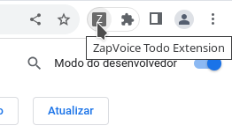


#### Modo de produção


_⚠️ Escolha a alternativa **A** ou **B** ⚠️_

**A)** No terminal com o _container_ da extensão realize o build da extensão:

```bash
npm run build -- --outDir unpacked
```

**B)** Utilize o diretório `unpacked`, que foi clonado junto com o projeto (`[caminho_onde_o_projeto_foi_clonado]/extension/unpacked`) nas instruções abaixo

Abra o chrome e carregue a extensão sem compactação de acordo com as instruções abaixo (instruções atualizadas e completas [disponíveis aqui](https://developer.chrome.com/docs/extensions/mv3/getstarted/development-basics/#load-unpacked)):

1. Vá para a página de extensões inserindo `chrome://extensions` em uma nova aba.
2. Habilite o Modo do desenvolvedor clicando no _toggle switch_ ao lado do texto **Modo do desenvolvedor**.
3. Clique no botão **Carregar sem compactação** e selecione o diretório da extensão (`[caminho_onde_o_projeto_foi_clonado]/extension/unpacked`)

Fixe a extensão de acordo com as instruções abaixo (instruções atualizadas e completas [disponíveis aqui](https://developer.chrome.com/docs/extensions/mv3/getstarted/development-basics/#pin)):

1. Clique no ícone do menu de extensões (a pequena peça de quebra-cabeças)
2. Fixe a extensão clicando no botão fixar ( um pequeno _pin_ a lado do nome da extensão)

Agora com a extensão carregada e fixada é possível utilizar a mesma clicando no ícone da extensão. 🎉


# 🧪 Testando o projeto

## 1️⃣ Testes unitários

### Backend (API)

Execute o comando:

```bash
npm run test
```

### Frontend (extensão do Chrome)

Execute o comando:

```bash
npm run test
```